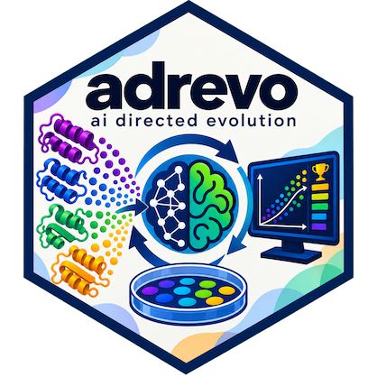

# adrevo <a href="https://zia1138.github.io/adrevo"></a>

**adrevo evolves algorithms with AI.** It asks language models for complete program improvements, evaluates each candidate against your test, and keeps the ones that score better.

Inspired by AlphaEvolve-style program evolution, adrevo adds **adaptive backtracking**: it explores locally improving branches, but when every configured model fails to improve a branch, it walks back up the last globally improving lineage and tries a different direction.

> Experimental software for research and algorithm development.

## Run an example

Prerequisites: Python 3.13+, [uv](https://docs.astral.sh/uv/), and an OpenAI API key.

```bash
git clone https://github.com/zia1138/adrevo.git
cd adrevo
uv sync
export OPENAI_API_KEY=...
uv run adrevo run examples/circle_packing --config config_openai.py
```

This evolves a solution for packing 26 circles in a unit square. Results are written to a timestamped `results_*` directory.

## Create a project: code as configuration

Create a directory containing these three files:

```text
my-project/
├── main.py       # your initial algorithm; adrevo rewrites this file
├── evaluate.py   # your evaluator; imports main.py and writes results.json
└── config.py     # your models and run settings
```

`config.py` is ordinary Python—not YAML. Define `get_adrevo_config()` and `get_backend_config()` there; each creates an `AdrevoConfig` or `BackendConfig`, overriding only the dataclass defaults you need (for example, a task prompt, budget, timeout, or data directories).

Also define `build_evo_models()`, which creates one or more `ModelSpec`s using [Pydantic AI's model API](https://pydantic.dev/docs/ai/models/overview). Multiple models are tried in configured order before adrevo backtracks. Keep variants such as `config_fast.py` or `config_openai.py`; adrevo will let you select one.

Start from the [circle-packing example](examples/circle_packing), especially its [configuration](examples/circle_packing/config_openai.py) and [evaluator](examples/circle_packing/evaluate.py).

## How search works

1. Models propose a complete replacement for `main.py`; `evaluate.py` decides whether it is valid and reports a `combined_score`.
2. A new global best becomes the committed search lineage. A local improvement can be explored as a side branch without replacing that lineage.
3. If the final model in the configured model list cannot improve the current branch, adrevo backtracks one or more ancestors (`backtrack_steps`) and continues from there.

The evaluator must treat larger `combined_score` values as better. See [the configuration dataclasses](src/adrevo/config.py) for all settings.

## Benchmarks

Results use benchmark suites adapted from [skydiscover](https://github.com/skydiscover-ai/skydiscover). The OpenEvolve, GEPA, ShinkaEvolve, and AdaEvolve comparison rows are reported from the [AdaEvolve paper](https://arxiv.org/abs/2602.20133) with a GPT-5 backbone.

### Mathematical optimization

| Strategy | Circle Packing ↑ | Circle Packing (Rect) ↑ | Heilbronn (Convex) ↑ | Heilbronn (Triangles) ↑ | MinMax Distance ↑ | Signal Processing ↑ |
|----------|-----------------:|------------------------:|---------------------:|------------------------:|------------------:|--------------------:|
| Human / SOTA | 2.634 | 2.364 | 0.0306 | 0.0360 | 0.2399 | – |
| AlphaEvolve | 2.635 | **2.3658** | 0.0309 | **0.0365** | 0.2398 | – |
| OpenEvolve | 2.541 | 2.276 | 0.027 | 0.028 | 0.2243 | 0.622 |
| GEPA | 2.628 | 2.354 | 0.027 | 0.032 | 0.2392 | 0.705 |
| ShinkaEvolve | 2.541 | 2.358 | 0.026 | 0.034 | 0.2398 | 0.533 |
| AdaEvolve | 2.63598308 | 2.361 | 0.029 | 0.036 | **0.2404** | 0.718 |
| **adrevo** | **2.63598308499572** | 2.3621 | **0.03092** | **0.0365** | 0.2401 | **0.956** |
| Cost (adrevo) | $1.27 | $1.81 | $3.16 | $4.61 | $1.62 | $2.61 |

adrevo beats SOTA on 3/5 mathematical-optimization benchmarks.

### ADRS

| Strategy | Cloudcast ↓ | EPLB ↑ | Prism ↑ | LLM-SQL ↑ | TXN ↑ |
|----------|------------:|-------:|--------:|----------:|------:|
| Human / SOTA | 626.2 | 0.1265 | 21.89 | 0.692 | 2,725 |
| OpenEvolve | 729.8 | 0.1272 | 26.23 | 0.716 | 4,329 |
| GEPA | 645.7 | 0.1445 | 26.23 | 0.713 | 3,984 |
| Shinka | 812.7 | 0.1272 | 26.26 | 0.713 | 4,329 |
| AdaEvolve | 640.5 | 0.1453 | **26.37** | 0.775 | **4,348** |
| **adrevo** | **618.07** | **0.1516** | 25.26 | **0.9893** | 4,273.50 |
| Cost (adrevo) | $3.20 | $1.99 | $0.22 | $1.11 | $1.46 |

adrevo beats SOTA on 3/5 ADRS benchmarks.

## Related work

### Search-based

[AlphaEvolve](https://deepmind.google/discover/blog/alphaevolve-a-gemini-powered-coding-agent-for-designing-advanced-algorithms/), [ShinkaEvolve](https://github.com/SakanaAI/ShinkaEvolve), [OpenEvolve](https://github.com/algorithmicsuperintelligence/openevolve), [LLM4AD](https://github.com/Optima-CityU/llm4ad), [skydiscover / AdaEvolve](https://github.com/skydiscover-ai/skydiscover), [GigaEvo](https://github.com/AIRI-Institute/gigaevo-platform/tree/main), [station](https://github.com/dualverse-ai/station), [autoresearch](https://github.com/karpathy/autoresearch), [GEPA](https://github.com/gepa-ai/gepa), and [CodeEvolve](https://github.com/inter-co/science-codeevolve).

### Reinforcement-learning-based

[ThetaEvolve](https://github.com/ypwang61/ThetaEvolve) and [TTT-Discover](https://github.com/test-time-training/discover).
